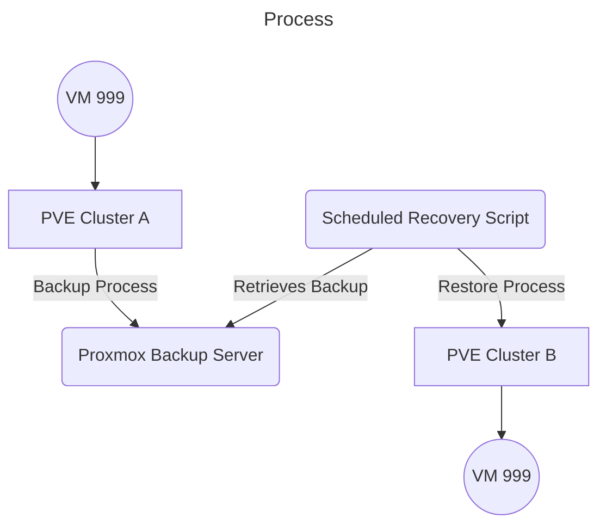

# Proxmox Scheduled Recovery

A simple script to automate the process of restoring backups in Proxmox VE.
We have an internal process that creates backups of VMs on a regular basis, using Proxmox Backup Server.
This script is designed to restore the latest backup of a specified VM or container on an offsite Proxmox VE server.
This way we can ensure that we have a recent copy of our VMs in case of a disaster.



## Features
- Automatically restores the latest backup of a specified VM or container.
- Configurable via command-line arguments.

## Requirements
- Proxmox VE API 2.0 or higher
- Python 3.9 or higher
- Requires API token with appropriate permissions
    - Datastore.Allocate
    - Datastore.AllocateSpace
    - SDN.Use
    - VM.Allocate
    - VM.Audit

## Configuration
Set the following environment variables for authentication:
- `PROXMOX_HOST`: Proxmox server hostname or IP address
- `PROXMOX_USER`: Proxmox username (e.g., `root@pam`)
- `PROXMOX_TOKEN_NAME`: API token name (only the name part, not the full `name@realm!tokenid`)
- `PROXMOX_TOKEN_VALUE`: API token value
- `PROXMOX_VERIFY_SSL`: Set to `True` to verify SSL certificates, `False` to skip verification (default: `False`)
- `PROXMOX_STORAGE`: Storage name where vm should be recovered to (e.g. `local`)
- `PROXMOX_BACKUP_STORAGE`: Storage name where backups are stored (e.g. `pbs02`)

## Usage
```bash
python proxmox_scheduled_recovery.py <vmid>
```

## Continuous Integration
GitHub Actions builds and lints this project on each push/PR using `uv` and `ruff`.
The workflow uploads `dist/` artifacts for download.


## Dependencies
- [`proxmoxer`](https://github.com/proxmoxer/proxmoxer/): Python wrapper for Proxmox API v2
- [`requests`](https://pypi.org/project/requests/): HTTP library for Python
